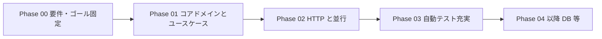

# 技術選定・設計判断の妥当な推定（インターン向け）

この文書は、本リポジトリの [`phase-00_requirements.md`](./phase-00_requirements.md) および [`AGENTS.md`](../AGENTS.md) に書かれた制約から読み取れる **意図** をもとに、**なぜその技術・フェーズ分割になりやすいか** を整理したものです。

議事録や公式の決裁ログではなく、**教材として妥当な推定モデル**です。レビューや面談で「自分ならどう決めるか」を話すときの **論点チェックリスト** として使ってください。

---

## 1. この推定が SWE インターンで効く理由

現場では「何を選んだか」より **トレードオフを言語化できるか** が問われます。

- 代替案は何だったか
- 何を優先し、何を後回しにしたか
- 学習／スコープ／運用／チームの熟練度でどう変わるか

本プロジェクトの要件は、その練習のために **意図的に線が引かれている** と読めるため、その読み取り自体が設計リテラシーの訓練になります。

---

## 2. 前提となるゴール（文書からの読み取り）

| 観点 | 読み取れるゴール |
|------|------------------|
| 主目的 | Go と API 設計に慣れ、DDD 寄りの責務分離を **説明・判断**できること |
| 優先順位 | 「とにかく動く」より **設計の説明可能性** |
| 進め方 | 最小構成から段階的に（フェーズで話題を増やさない） |

---

## 3. 主要な技術判断と推定される理由

### 3.1 実装言語: Go

| 項目 | 内容 |
|------|------|
| **決まっていること** | 実装言語は Go（要件・AGENTS） |
| **推定される理由** | バックエンド実務に近い記述モデルであり、型・インタフェース・エラー処理を通じて **レイヤ境界をコードで議論しやすい**。説明責任のあるインターン準備として選択されやすい。 |
| **レビューで言えること** | 「チーム標準」「運用・デプロイの実態」「ライブラリエコシステム」との整合は別論点であり、本教材では **設計練習のため Go に固定**している、など。 |

### 3.2 アーキテクチャ: DDD / Clean Architecture 寄り

| 項目 | 内容 |
|------|------|
| **決まっていること** | handler → usecase → domain → repository の意識、ドメインに外部 I/O を置かない（AGENTS） |
| **推定される理由** | 学習ゴールが Entity / VO / Repository / Usecase の **責務説明**であるため、フレームワークに業務ロジックを寄せると目的からズレる。**説明の単位**がレイヤと対応する形が選ばれやすい。 |
| **レビューで言えること** | 「過剰な DDD」より **説明可能な分割**。実務ではチーム規約やボイラープレートとのバランスで調整する、など。 |

### 3.3 永続化: Phase 01〜03 は in-memory、DB は Phase 04 以降

| 項目 | 内容 |
|------|------|
| **決まっていること** | Phase 01〜03 は in-memory。DB は計画のみ（要件セクション 3・6） |
| **推定される理由** | DB を早期に入れるとスキーマ・マイグレーション・クエリが主題になり、**ユースケースとドメインルールの練習にリソースが割けなくなる**。教材としてスコープを後ろへ封印する割り切り。 |
| **レビューで言えること** | プロトタイプ／学習ではインメモリで十分。**整合性・耐久性・クエリ要件**が出た時点で DB に昇格させる、という典型的な段階化。 |

### 3.4 Phase 01 で HTTP を含めない

| 項目 | 内容 |
|------|------|
| **決まっていること** | Phase 01 は HTTP API を含めない（要件フェーズ表・AGENTS） |
| **推定される理由** | JSON・ステータスコード・ルーティングは話題が増える。**アプリケーションコア（ユースケースとドメインとリポジトリ抽象）** に集中させるための切段。Clean Architecture でよくある「内側から組み立てる」順序と整合。 |
| **レビューで言えること** | テストや再利用のしやすさのため **ドメインを HTTP に依存させない**。境界は Phase 02 の handler で閉じる、など。 |

### 3.5 Phase 02 の HTTP: `net/http` または軽量ルーター

| 項目 | 内容 |
|------|------|
| **決まっていること** | net/http または軽量ルーター（AGENTS）。複雑なフレームワークは最初から入れない（AGENTS 禁止事項） |
| **推定される理由** | 依存と魔法を増やさず **HTTP の責務（入出力変換・ステータス）** を学ぶため。軽量ルーターはルーティングの可読性とのトレードオフで許容されていると読める。 |
| **レビューで言えること** | 標準ライブラリは依存ゼロだが冗長になりうる。ルーターは DX と依存追加のトレードオフ。**チームの標準と監査要件**で決める、など。 |

### 3.6 並行性: Phase 01 は単一ワーカー、Phase 02 で in-memory に排他

| 項目 | 内容 |
|------|------|
| **決まっていること** | Phase 01 は並行呼び出しを想定しない。Phase 02 は HTTP により並行があり得るため in-memory に Mutex 等（要件セクション 3・6） |
| **推定される理由** | Phase 01 で Mutex を必須にすると **ドメイン以前の話題**が増える。一方 Phase 02 は現実のサーバモデルに寄せるため **データ競合を要件として明示**。インメモリのまま正しさの下限を上げる現実的な線引き。 |
| **レビューで言えること** | インメモリはプロセス内整合性のみ。**複製・マルチインスタンス・永続化**では別設計が必要、など。 |

### 3.7 自動テスト: Phase 01 は完了条件に含めず、Phase 03 が主戦場

| 項目 | 内容 |
|------|------|
| **決まっていること** | Phase 01 は手動またはスクリプトで可。ユースケース単位の自動テストは Phase 03 が主（要件セクション 3・6） |
| **推定される理由** | 一度に「設計」「実装」「テスト」「モック」を課すと脱落しやすい。**テストしやすい構造（Clock 注入など）** は要件で触れつつ、テスト自体は後フェーズで厚くするバランス。 |
| **レビューで言えること** | 実務では CI とセット。**テスタビリティは設計時に決まる**ので、Phase 01 の設計時点で注入ポイントを意識する価値がある、など。 |

### 3.8 ドメイン細則（UUID・UTC・エラー種別など）

| 項目 | 内容 |
|------|------|
| **決まっていること** | タスク ID は UUID、作成日時は UTC、`Clock` 注入が望ましい、Validation と NotFound を区別（要件セクション 5） |
| **推定される理由** | API 設計で頻出の論点を **要件に埋め込み**、レビューで「どこで生成するか」「時刻をどうテストするか」「エラーをどうマッピングするか」を説明させるため。 |
| **レビューで言えること** | UUID は透過性と衝突耐性のトレードオフ、連番は情報露出や協調生成の論点。**業務要件とセキュリティ**で決める、など。 |

---

## 4. フェーズ分割としての「線引き」の読み取り

以下は **単一の連続した製品開発**というより、**学習の話題を増やさないためのカリキュラム設計**として読める整理です。

インターン本番でも、「今週は境界を増やさない」「次のスプリントで観測性」といった **スコープ管理**は同型の判断になります。

---

## 5. 自分用のチェックリスト（面談・設計レビュー用）

判断を説明するとき、次を埋められると強いです。

1. **優先した価値**: 正しさ／速度／学習コスト／運用／セキュリティのどれか。
2. **捨てたもの**: 何を Phase 04 以降や「対象外」にしたか。
3. **変わる条件**: ユーザー複数化・マルチインスタンス・SLA が付いたら何を見直すか。
4. **要件との対応**: このリポジトリなら [`phase-00_requirements.md`](./phase-00_requirements.md) のどの節に書いてあるか。

---

## 6. メンテナンス方針

- **要件や AGENTS の「正」が変わったら**、本書の「決まっていること」の列は要件側に追随して更新してください。
- 本書は **推定モデル**です。実際の社内決裁プロセスや別の代替案があれば、学習ノートや README に自分の考察を追記するとよいです。
